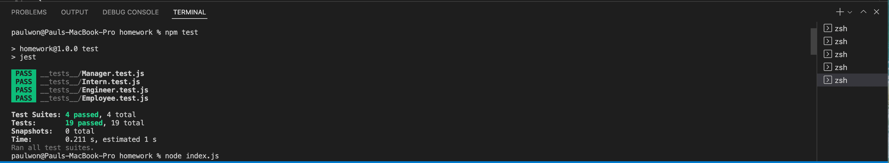
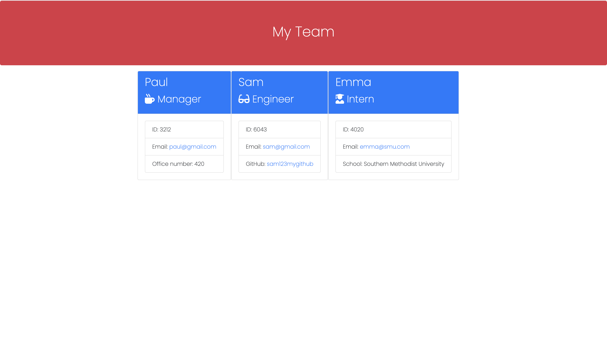

### Homework Assignment #10:
-----------------------

#### Overview:
- For this homework assignment, I was tasked in creating an application using Node.js that will take in information about an employee and generates an HTML file that displays a summary of each employees.
 

#### Process:
- In the process of creating the application, I first initiated 'npm init' and after doing so, installed the ncessary npm modules that will be used such as jest and inquirer.

- When the user is promted to a question regarding which type of employee the user like to add, a sepereate function is invoked based on the response. (when add engineer is chosen, the function that generates the questions/response is invoked accordingly).

- Seperate files were created which included 'Employee', 'Intern', 'Manager', 'Engineer' classes with their own individual properties and methods.

- Furthermore, JEST was used to test the functionality of each employee and the test files were stored in a folder named __test__.
 

#### Additional Documents:

- link to github repo:
- link to video: https://www.youtube.com/watch?v=BIInxw5wKXk
 
- Screenshots:

